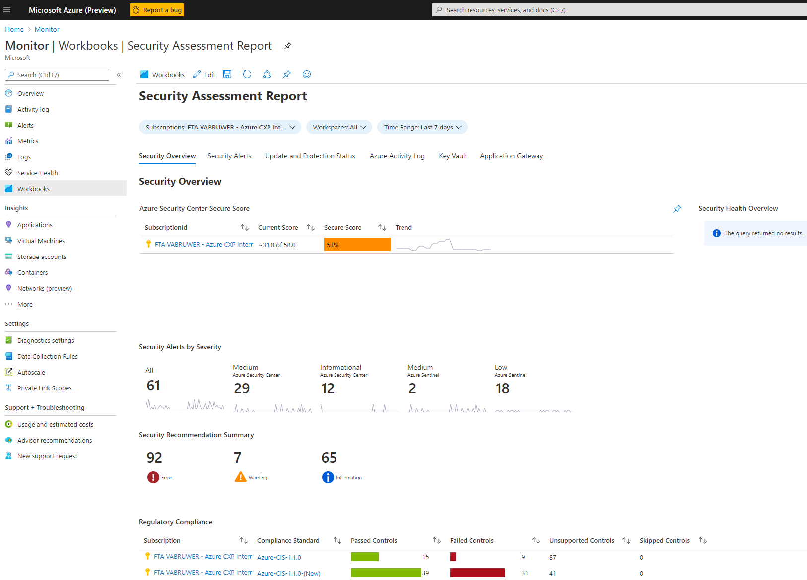

# SecurityOptimization

As companies increase their cloud investments, security optimization should become a crucial and integrated part of day-to-day operations. Securing cloud infrastructure at scale requires deep insight into your optimization potential and changes to your culture to implement sustainable security improvements.

Here we provide different scripts to help you optimize you security posture on Azure. 
After clicking the button bellow you can choose what you want to deploy and fill out the parameters. 

We explain the different deployment options bellow 

 * **Enable Security Center Standard** 

All Azure subscriptions come with Security Center free enabled. This already gives you a big insight over you Azure environment security posture. You can see your secure score and our security recommendations. However, for production environments, we definatelly advise you to enalbe security center standard.  Center Standard helps you find and fix security vulnerabilities, apply access and application controls to block malicious activity, detect threats using analytics and intelligence, and respond quickly when under attack. You can try Security Center Standard at no cost for 30 days when you enable it. You can consult the prices that you pay after it [here](https://azure.microsoft.com/en-us/pricing/details/security-center/).
 
By selecting to enable security center standard through our template we will also select the option to automatically provision Microsoft Monitoring Agents to your machines. This way all your Azure machines will get MMA and will send security logs to a log analytics workspace, which will then be queried by ASC. That is why we ask you to also write down the name for the log analytics workspace. 
If you already have ASC but you want to enable the autoprovisiong of agent, you can go ahead select yes under "Deploy Security Center Standard" and write down the name for the new or existing log analytics workspace that you want the logs to be sent to.
 
  * **Enable Sentinel** 
 
 * **Assign policies to collect diagnostic logs**
 
 Improving security comes hand in hand with governance. You can remediate the security recommendations as they appear, but as your environment grows, it is probable that you will get that recommendation again. We propose that you solve this through governance, by making sure that some security requirements are automatically applied as you develop your environment. We suggest assigning policies to automatically enable diagnostic logs collection from key vault, app gw, nsg, and azure firewall. These logs will be collected in the log analytics workspace that you indicate (the template will create a new one or use one that already exists). You will automatically be able to see dashboards on those logs if you deploy our workbook.
 
 
 * **Deploy workbook to help you follow and analyze your security center recommendations, alerts and trends**

We developed this workbook to make it easier for you to check Security Center, Sentinel and dashboards related to some of the diagnostic logs that you have enabled in one place.

 

  

 
  
  
  
  
  
 
 
>  FastTrack for Azure are “Professional Services” subject to the “Professional Services Terms” in the Online Services Terms and Online Services Data Protection Addendum. This document is provided “AS-IS,” WITHOUT WARRANTY OF ANY KIND. Microsoft disclaims all express, implied or statutory warranties, including warranties of quality, title, non-infringement, merchantability and fitness for a particular purpose. 
